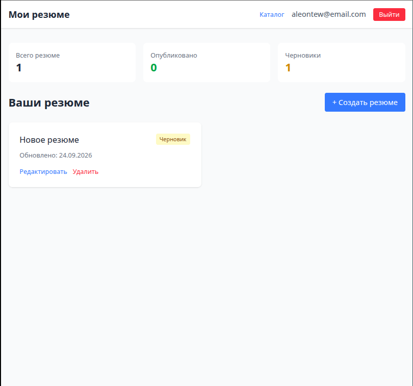
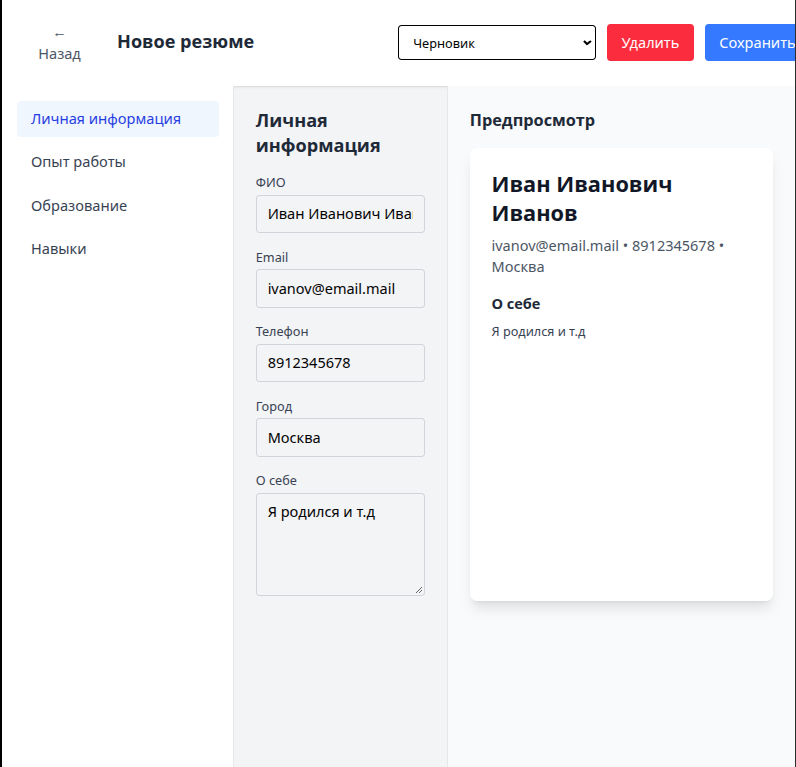
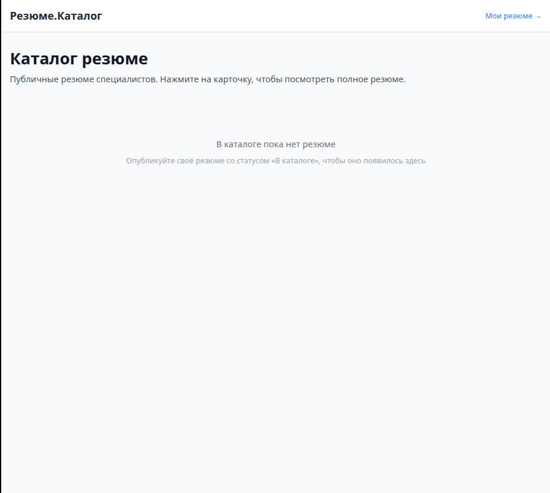

# Resume Builder

Full-stack приложение для создания, редактирования и публикации резюме.

🌐 Live Demo: https://resume-builder-alexbeard.vercel.app/

## Стек

### Frontend
- React 18 + Vite
- TypeScript
- Redux Toolkit
- React Router
- Tailwind CSS

### Backend
- Node.js + Express
- Prisma ORM
- PostgreSQL (Supabase)
- JWT + bcrypt

### Инфраструктура
- Vercel (frontend)
- Railway (backend)
- Supabase (database)

## Возможности

- 🔐 Авторизация (JWT + refresh tokens)
- 📝 CRUD резюме (личные данные, опыт, образование, навыки)
- 🎨 Живой предпросмотр
- 🔄 Drag & Drop для сортировки опыта
- 💾 Автосохранение (debounce)
- 📢 Три статуса: черновик / по ссылке / в каталоге
- 🌐 Публичная страница резюме (/view/:username)
- 🔍 Каталог публичных резюме
- 🔒 Хеширование паролей (bcrypt)
- ✅ Покрытие тестами (Vitest + RTL)

## Скриншоты






## Локальный запуск

### 1. Клонировать репозиторий
```bash
git clone https://github.com/Alexbeard1998/resume-builder.git
cd resume-builder
```

### 2. Установить зависимости

Frontend:

```bash
npm install
```

Backend:

```bash
cd server
npm install
```

### 3. Настроить переменные окружения

Корень (.env.local):

```text
VITE_API_URL=http://localhost:3001/api
```

Сервер (server/.env):

```text
DATABASE_URL="postgresql://..."
DIRECT_URL="postgresql://..."
JWT_SECRET="..."
REFRESH_SECRET="..."
PORT=3001
```

### 4. Применить миграции

```bash
cd server
npx prisma migrate dev
```

### 5. Запустить
Backend (терминал 1):

```bash
cd server
npm run dev
```
Frontend (терминал 2):

```bash
npm run dev
Открыть http://localhost:5173
```

### Тесты

```bash
npm run test:run
```

### Структура проекта
```text
resume-builder/
├── src/                     # Frontend
│   ├── app/                 # Store, router
│   ├── components/          # UI-компоненты
│   ├── features/            # Redux-слайсы по фичам
│   ├── api/                 # HTTP-клиент
│   └── utils/               # Хелперы
└── server/                  # Backend
    ├── prisma/              # Схема БД
    └── index.js             # Express-сер
```

### Лицензия
MIT